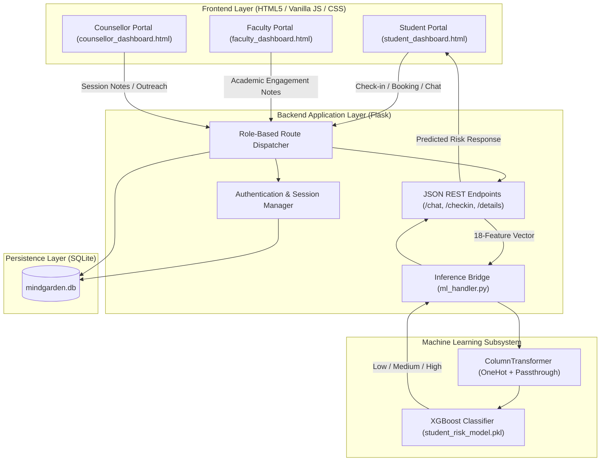
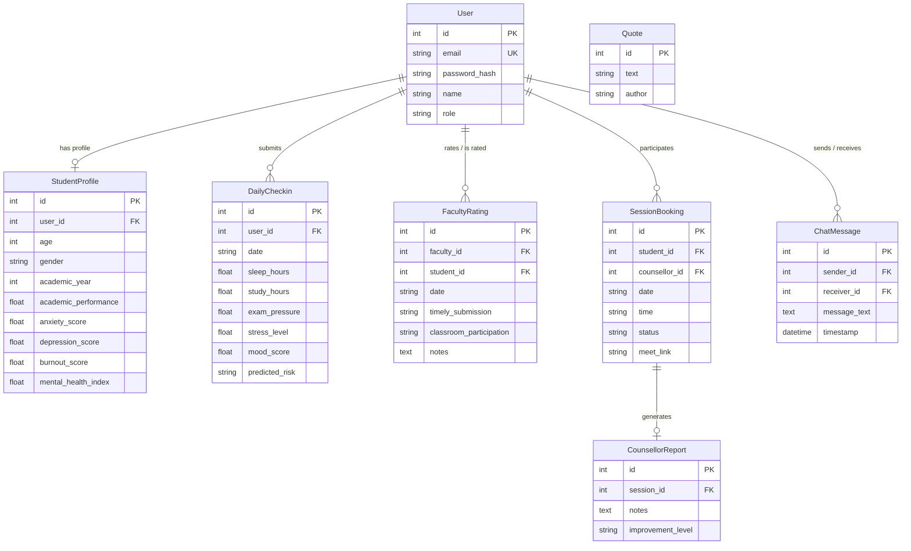

# MindGarden: Complete Project Architecture & Documentation

MindGarden is an interactive, full-stack AI-driven web platform designed to monitor and predict student mental health risk levels using machine learning. It serves as a coordinated intervention hub connecting **Students**, **Faculty**, and **Campus Counsellors**.

---

## Table of Contents
1. [System Architecture & Data Flow](#1-system-architecture--data-flow)
2. [Stakeholder Portals & User Journeys](#2-stakeholder-portals--user-journeys)
3. [Machine Learning Pipeline](#3-machine-learning-pipeline)
4. [Database Schema & Entity Relationships](#4-database-schema--entity-relationships)
5. [Complete File & Folder Structure](#5-complete-file--folder-structure)
6. [Detailed Breakdown of Every File](#6-detailed-breakdown-of-every-file)
7. [System Lifecycle & Inter-file Interaction](#7-system-lifecycle--inter-file-interaction)
8. [Default Seed Credentials & Testing](#8-default-seed-credentials--testing)

---

## 1. System Architecture & Data Flow



---

## 2. Stakeholder Portals & User Journeys

The platform enforces Role-Based Access Control (RBAC) across three distinct roles:

### 1. Student Portal (`student_dashboard.html`)
* **Onboarding Baseline Survey:** New students complete a 14-parameter baseline survey capturing demographics, academic performance, baseline anxiety/depression/burnout scores, sleep habits, screen time, and financial/family stress.
* **Daily Check-ins:** Students log daily metrics using interactive range sliders (Sleep Hours, Study Hours, Exam Pressure, Stress Level, Mood Score). Submitting this immediately triggers real-time XGBoost inference to predict their current risk status (**Low**, **Medium**, or **High**). Duplicate daily logs are prevented.
* **Thought of the Day:** An inspirational mental health quote is randomly retrieved from the database to encourage positive mindset habits.
* **Consultations & Scheduling:** Students can schedule virtual appointments with campus counsellors, generating instant mock Google Meet video links.
* **Real-time Messaging:** Students can chat directly with available counsellors with periodic background message synchronization.
* **Profile Management:** Students can update their baseline parameters at any time from their dashboard.

### 2. Faculty Portal (`faculty_dashboard.html`)
* **Student Directory:** Faculty members can view all active students enrolled in their courses.
* **Academic Engagement Logging:** Faculty evaluate students on:
  * Timely Assignment Submissions (*Yes / No*)
  * Classroom Participation Level (*High / Medium / Low*)
  * Qualitative Observational Notes (e.g., missed lectures, sudden drop in work quality).
* **Strict Privacy Boundary:** In accordance with institutional data policies, faculty **never** see psychological test scores, clinical notes, or predicted risk levels. They only have access to academic metrics.

### 3. Counsellor Portal (`counsellor_dashboard.html`)
* **AI Priority Flagged Queue (Early Warning Alert):** The system automatically scans daily logs and elevates any student who records a **High Risk prediction for 3 or more consecutive days** to the top of the queue.
* **360° Student Drilldown Modal:** Counsellors can inspect a comprehensive view of any student:
  * Baseline psychological indicators.
  * Faculty academic observations and attendance/submission behavior.
  * Recent 5-day daily check-in logs and mood progression.
* **Consultation Reports & Progress Tracking:** Counsellors manage booked appointments, log clinical session notes, and record client improvement levels (*Significant, Moderate, No Change, Deterioration*).
* **Direct Student Messaging:** Dedicated split-panel messenger allowing direct communication with any student.

---

## 3. Machine Learning Pipeline

The mental health risk classification model is trained on `CEP_Train_Data.csv` and predicts multi-class student risk: `Low`, `Medium`, or `High`.

### The 18 Input Features
| # | Feature Name | Type | Description / Range |
|---|---|---|---|
| 1 | `age` | Numerical | Student age (15–50) |
| 2 | `gender` | Categorical | Female, Male, Other (One-Hot Encoded) |
| 3 | `academic_year` | Numerical | 1st, 2nd, 3rd, or 4th year |
| 4 | `study_hours_per_day`| Numerical | Hours spent studying per day |
| 5 | `exam_pressure` | Numerical | Scale from 0 to 10 |
| 6 | `academic_performance`| Numerical | Academic average percentage (0–100) |
| 7 | `stress_level` | Numerical | Self-reported stress level (0–10) |
| 8 | `anxiety_score` | Numerical | Baseline anxiety score (0–10) |
| 9 | `depression_score` | Numerical | Baseline depression score (0–10) |
| 10 | `sleep_hours` | Numerical | Nightly sleep duration |
| 11 | `physical_activity` | Numerical | Hours of daily physical activity |
| 12 | `social_support` | Numerical | Level of social support (0–10) |
| 13 | `screen_time` | Numerical | Hours spent on screens per day |
| 14 | `internet_usage` | Numerical | Daily recreational internet hours |
| 15 | `financial_stress` | Numerical | Financial strain level (0–10) |
| 16 | `family_expectation`| Numerical | Perceived family pressure (0–10) |
| 17 | `burnout_score` | Numerical | Burnout level (0–10) |
| 18 | `mental_health_index`| Numerical | Overall self-rated wellness index (0–10) |

### Preprocessing & Architecture
* **ColumnTransformer:** Uses `OneHotEncoder(handle_unknown='ignore', sparse_output=False)` for nominal attributes (`gender`), while passing numerical columns through directly.
* **Target Encoding:** Uses Scikit-Learn's `LabelEncoder` to translate target categories `[High, Low, Medium]` into numerical indices `[0, 1, 2]`.
* **Class Imbalance Mitigation:** Computes sample weights using `compute_sample_weight("balanced", y_train)` during fitting to ensure balanced precision across all risk classes.
* **Algorithm:** `XGBClassifier` configured with 100 trees, maximum tree depth of 5, learning rate of 0.05, and `multi:softprob` objective.
* **Inference Singleton (`ml_handler.py`):** Encapsulates pipeline loading and inverse label transformation with fallback safety handling.

---

## 4. Database Schema & Entity Relationships



---

## 5. Complete File & Folder Structure

```
CEP_Project/
├── .git/                                 # Git version control metadata
├── .gitignore                            # Excluded patterns (virtualenvs, large CSVs, DBs)
├── .venv/                                # Local Python 3 virtual environment
├── __pycache__/                          # Python runtime bytecode caches
│
├── app.py                                # Main Flask server, routes, DB schemas, auth logic
├── requirements.txt                      # Project dependency specification
├── README.md                             # Repository setup & high-level documentation
│
├── ml/                                   # Machine Learning Subsystem
│   ├── __init__.py                       # Package marker
│   ├── ml_handler.py                     # ML runtime bridge: model loading & inference wrapper
│   ├── student_risk_model.pkl            # Serialized trained Scikit-learn / XGBoost pipeline
│   ├── train_and_save_model.py           # Standalone training script to build student_risk_model.pkl
│   ├── CEP_Train_Data.csv                # Dataset used for training student risk model (~294MB)
│   └── CEP_Code.ipynb                    # Jupyter research notebook (EDA & experimentation)
│
├── templates/                            # Jinja2 template views
│   ├── layout.html                       # Base layout, navbar, SEO meta, sidebar container
│   ├── login.html                        # Authentication view (Login / Signup with .edu filter)
│   ├── student_dashboard.html            # Student onboarding, daily check-in, bookings, and chat
│   ├── faculty_dashboard.html            # Faculty student directory and academic rating forms
│   └── counsellor_dashboard.html         # Priority flagged queue, drilldown modal, session reports
│
├── static/                               # Static frontend assets
│   ├── script.js                         # Dynamic interactions, AJAX checkins, and chat polling
│   └── style.css                         # Ditto design system stylesheet (variables, components)
│
├── instance/                             # Flask application instance folder
│   └── mindgarden.db                     # Active SQLite database file
│
├── tests/                                # Testing & Verification
│   └── verify_app_integration.py         # Integration test suite validating DB, ML, and endpoints
│
└── docs/                                 # Documentation & Backups
    ├── PROJECT_DOCUMENTATION.md          # Complete architecture documentation
    └── instance.zip                      # Compressed backup of the database instance
```

---

## 6. Detailed Breakdown of Every File

### Application Core
* **`app.py`**:
  * **Role:** Central backend server.
  * **Contents:** Defines 8 SQLAlchemy models (`User`, `StudentProfile`, `DailyCheckin`, `FacultyRating`, `SessionBooking`, `CounsellorReport`, `ChatMessage`, `Quote`). Contains session authentication handlers (`/login`, `/signup`, `/logout`), student onboarding, daily check-in endpoint (`/student/checkin`), booking, faculty evaluation submission, counsellor report generation, and AJAX JSON endpoints (`/chat/send`, `/chat/history/<id>`, `/counsellor/student/details/<id>`). Automatically runs database table creation and initial seeding (`seed_db()`). Imports `predictor` from `ml.ml_handler`.

* **`requirements.txt`**:
  * **Role:** Pinned Python dependency list (`Flask`, `Flask-SQLAlchemy`, `xgboost`, `scikit-learn`, `pandas`, `numpy`, `joblib`, etc.).

* **`README.md`**:
  * **Role:** Repository overview, feature summaries, quickstart guide, and design documentation.

* **`.gitignore`**:
  * **Role:** Git exclusion rules for large datasets (`ml/CEP_Train_Data.csv`), bytecode, virtual environments (`.venv/`), and database backups (`docs/instance.zip`).

### Machine Learning (`ml/`)
* **`ml/__init__.py`**:
  * **Role:** Package marker allowing clean imports (`from ml.ml_handler import predictor`).

* **`ml/ml_handler.py`**:
  * **Role:** Runtime inference manager.
  * **Contents:** Implements the `MLPredictor` class. Instantiates a singleton `predictor` imported by `app.py`. Loads `student_risk_model.pkl` relative to its own folder on application boot, parses student feature dictionaries, aligns feature columns, passes them to the XGBoost pipeline, and returns decoded risk ratings (`Low`, `Medium`, `High`) with safety fallbacks.

* **`ml/student_risk_model.pkl`**:
  * **Role:** Binary model artifact.
  * **Contents:** Serialized dictionary containing the trained Scikit-Learn `Pipeline`, fitted `LabelEncoder`, and required feature names list.

* **`ml/train_and_save_model.py`**:
  * **Role:** Training pipeline.
  * **Contents:** Reads `CEP_Train_Data.csv`, removes target leakage fields (`dropout_risk`, `dropout_labels`), constructs preprocessing transformers, applies class balancing weights, trains `XGBClassifier`, prints train/test accuracy metrics, and serializes the final pipeline to `student_risk_model.pkl`.

* **`ml/CEP_Train_Data.csv`**:
  * **Role:** Raw tabular training data containing historical student records and multi-class risk targets.

* **`ml/CEP_Code.ipynb`**:
  * **Role:** Research notebook containing exploratory data analysis, visual correlation matrices, feature distributions, and prototype evaluation.

### Frontend Views & Design System
* **`templates/layout.html`**:
  * **Role:** Base layout shell.
  * **Contents:** Sets HTML `<head>`, viewport, SEO descriptions, links `style.css` and `script.js`. Renders the persistent left-side navigation sidebar with the MindGarden logo, active navigation markers, and logout action.

* **`templates/login.html`**:
  * **Role:** User authentication page.
  * **Contents:** Dual-tab card for Login and Signup. Includes role selector dropdown, error banner displays, collegiate `.edu` email domain enforcement, and quick test credentials helper.

* **`templates/student_dashboard.html`**:
  * **Role:** Student interface.
  * **Contents:** Two operational states: (1) Onboarding Baseline Survey for first-time students, and (2) Active Student Dashboard featuring the dynamic "Thought of the Day", daily check-in slider form, 7-day check-in history table, appointment booking widget with Google Meet link viewer, live counsellor chat box, and profile update forms.

* **`templates/faculty_dashboard.html`**:
  * **Role:** Faculty interface.
  * **Contents:** Student class roster, interactive academic rating form (timely submissions, participation level, feedback notes), and weekly academic engagement summary table. Strict privacy controls prevent exposure of mental health or clinical risk scores.

* **`templates/counsellor_dashboard.html`**:
  * **Role:** Counsellor interface.
  * **Contents:** Priority Flagged Queue for students with $\ge 3$ consecutive High-Risk logs, General Student Health Directory with risk badges, interactive 360° student summary modal, consultation schedule manager, post-session clinical notes modal, and split-pane student chat messenger.

* **`static/style.css`**:
  * **Role:** Stylesheet implementing the **Ditto Design System**.
  * **Contents:** CSS custom properties (`--color-canvas: #f9fbf2`, `--color-soft-meadow: #eff2e5`, `--color-hi-yellow: #ffe228`, `--color-deep-ink: #130e30`), typography definitions (*Hedvig Letters Serif* and *Inter*), 3D tactile button styles (`.btn-3d`), custom range slider thumb stylings, responsive card layouts, priority badges, and modal window overlays.

* **`static/script.js`**:
  * **Role:** Frontend interactive behaviors.
  * **Contents:** Dynamically updates slider display values on input, handles asynchronous chat message submissions via the Fetch API, auto-scrolls chat containers, polls for new messages every 5 seconds, and controls modal opening/closing.

### Database & Persistence
* **`instance/mindgarden.db`**:
  * **Role:** The live SQLite relational database storing all student profiles, check-in histories, ratings, appointments, and chat messages.

### Quality Assurance & Testing
* **`tests/verify_app_integration.py`**:
  * **Role:** Integration verification test suite.
  * **Contents:** Validates model file presence, tests imports of Flask and SQLAlchemy models, verifies that `predictor` in `ml/ml_handler.py` is initialized, tests model predictions on mock low-risk and high-risk student profiles, and verifies database table creation and seed record counts.

### Documentation & Backups
* **`docs/PROJECT_DOCUMENTATION.md`**:
  * **Role:** In-depth technical specification, data dictionary, and architectural diagrams.

* **`docs/instance.zip`**:
  * **Role:** Compressed backup archive of the database instance.

---

## 7. System Lifecycle & Inter-file Interaction

```
[1. Training Phase]
  ml/CEP_Train_Data.csv ──> ml/train_and_save_model.py ──> ml/student_risk_model.pkl

[2. Application Startup]
  app.py boots ──> loads instance/mindgarden.db
               ──> imports predictor from ml/ml_handler.py (loads ml/student_risk_model.pkl)
               ──> seeds default users and quotes via seed_db()

[3. User Interaction & Daily Check-in]
  Student opens browser ──> app.py serves templates/student_dashboard.html (styled by static/style.css)
  Student moves sliders ──> static/script.js syncs slider labels
  Student submits log   ──> static/script.js sends POST to /student/checkin
                        ──> app.py merges daily metrics with baseline profile
                        ──> ml/ml_handler.py runs prediction via XGBoost pipeline
                        ──> DailyCheckin record saved with predicted risk (Low/Medium/High)
                        ──> AJAX response animates confirmation card in student UI

[4. Counsellor Early Intervention]
  Counsellor logs in    ──> app.py evaluates consecutive high-risk days from DailyCheckin
                        ──> If consecutive days >= 3, student elevated to AI Priority Flagged Queue
                        ──> Counsellor clicks student ──> loads details via /counsellor/student/details/<id>
                        ──> Counsellor books session / chats with student
                        ──> Counsellor submits post-session progress report
```

---

## 8. Default Seed Credentials & Testing

On first initialization, `app.py` seeds default test accounts for immediate evaluation:

| Role | Email | Password |
|---|---|---|
| **Student** | `student@college.edu` | `student123` |
| **Faculty** | `faculty@college.edu` | `faculty123` |
| **Counsellor** | `counsellor@college.edu` | `counsellor123` |

*(All signups enforce college domains ending with `.edu`.)*
